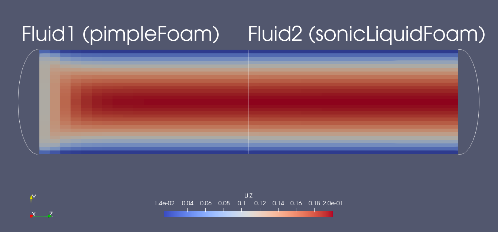



## Setup

This scenario consists of two pipes connected in series. A fluid enters from the left (here $$ z=0 $$) boundary of the Fluid1 participant with a uniform velocity profile ($$ u_{in} = 0.1 m/s $$) and zero pressure gradient. In its starting, uncoupled state, it exits from the right side (outlet: zero velocity gradient, zero pressure). This is also the coupling interface with Fluid2, which has the same boundary conditions as Fluid1.

On the coupling interface, Fluid1 sends velocity and pressure gradient to Fluid2 and receives pressure. The additional pressure gradient exchange was found to help convergence [1], but this fluid-fluid coupling scenario is part of active research.

## Available solvers

Both for Fluid1 and Fluid2, the following participants are available:

* OpenFOAM (pimpleFoam). An incompressible OpenFOAM solver. For more information, have a look at the [OpenFOAM adapter documentation](adapter-openfoam-overview.html).

* OpenFOAM (sonicLiquidFoam). A compressible OpenFOAM solver. For more information, have a look at the [OpenFOAM adapter documentation](adapter-openfoam-overview.html).

## Running the Simulation

All listed solvers can be used in order to run the simulation. Open two separate terminals and start the desired fluid1 and fluid2 participants by calling the respective run script. For example:

```
cd fluid1-openfoam-pimplefoam
./run.sh
```
and
```
cd fluid2-openfoam-sonicliquidfoam
./run.sh
```

## Post-processing

The OpenFOAM solvers generate a `.foam` file each. You can open this file in ParaView.
An example of the visualized expected results looks as follows:



Observe that the velocity and pressure values are smoothly changing around the coupling interface. The simulation starts with oscillations, which disappear after a few time steps.

## References

[1]  G. Chourdakis, B. Uekermann, G. V. Zwieten, and H. V. Brummelen: [Coupling OpenFOAM to different solvers, physics, models, and dimensions using preCICE](https://mediatum.ub.tum.de/1515271), 14th OpenFOAM Workshop, Duisburg, Germany, submitted (proceedings publication delayed/cancelled), July 2019.


