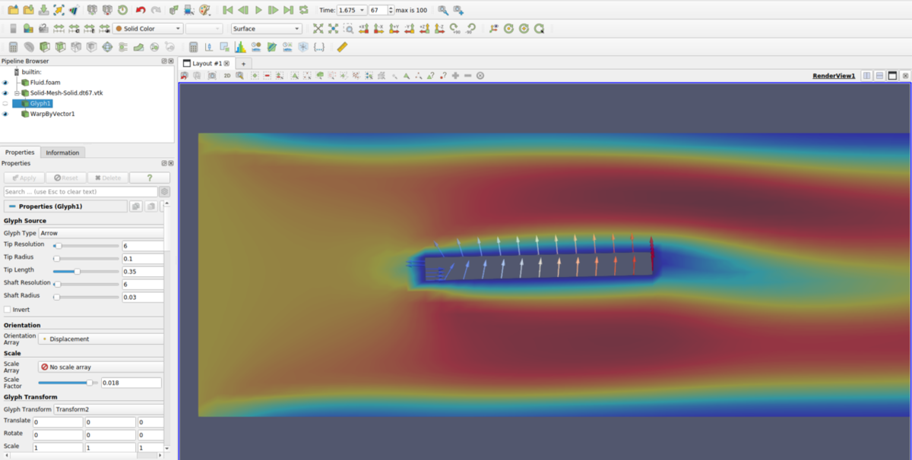

This is the first step you may want to try if you are new to preCICE: install preCICE and some solvers, and run a simple coupled case.

To get a feeling what preCICE does, watch a [short presentation](https://www.youtube.com/watch?v=FCv2FNUvKA8), a [longer talk on the fundamentals](https://www.youtube.com/watch?v=9EDFlgfpGBs), or [click through a tutorial in your browser](http://run.precice.org/).

## Installation

1. Get and install preCICE. For Ubuntu 20.04 (Focal Fossa), this is pretty easy: [download](https://github.com/precice/precice/releases/latest) and install our binary package by clicking on it or using the following commands:
    ```bash
    wget https://github.com/precice/precice/releases/download/v2.2.0/libprecice2_2.2.0_focal.deb
    sudo apt install ./libprecice2_2.2.0_focal.deb
    ```
    - Are you using something else? Just pick what suits you best on [this overview page](installation-overview.html).
    - Facing any problems? [Ask for help](community-channels.html).
2. We will use OpenFOAM here and in many of our tutorial cases, so [install OpenFOAM](adapter-openfoam-support.html):
    ```bash
    # Add the signing key, add the repository, update (check this):
    wget -q -O - https://dl.openfoam.com/add-debian-repo.sh | sudo bash
    # Install OpenFOAM v2012:
    sudo apt-get install openfoam2012-dev
    ```
3. Download and install the [OpenFOAM-preCICE adapter](adapter-openfoam-get.html):
    ```bash
     git clone --branch=master --depth 1 https://github.com/precice/openfoam-adapter
     cd openfoam-adapter
     ./Allwmake
     cd ..
    ```
4. Get the quickstart tutorial case:
    ```bash
    git clone --branch=master --depth 1 https://github.com/precice/tutorials.git
    cd tutorials/quickstart
    ```

If you prefer to easily try everything in an isolated environment, you may prefer using our [demo virtual machine](installation-vm.html).

## Case setup

We will couple OpenFOAM with a C++ rigid body solver for fluid-structure interaction. The rigid body has only a single degree of freedom, namely the deflection angle of the flap in the channel. It is also fixed in the origin at (0,0) and the force exerted by the fluid on the rigid body structure causes an oscillatory rotation of the body. The simulation runs for 2.5 seconds.

In order to gain more control over the rigid body oscillation, a rotational spring is applied at the rigid body origin. After 1.5 seconds we increase the spring constant by a factor of 8 to stabilize the coupled problem. Feel free to modify these parameters (directly in `rigid_body_solver.cpp`) and increase the simulation time (in `precice-config.xml`).


## Building the rigid body solver

Before starting the coupled simulation, the rigid body solver needs to be built using CMake. You can run the following commands from the `quickstart/` directory to build the `rigid_body_solver.cpp`
```
cd solid-cpp
cmake . && make
```

## Running the coupled simulation

You may run the two simulations in two different terminals and watch their output on the screen using `./run.sh` (or `./run.sh -parallel`, option only available for OpenFOAM) from inside the directory of each participant. You can cleanup the simulation using `./clean-tutorial.sh`.

In serial, the simulation should take roughly 30 seconds to compute.

## Visualizing the results

You can visualize the simulation results of the `Fluid` participant using ParaView and loading the (empty) file `Fluid.foam`. The rigid body does not generate any readable output files, but the motion can be observed in the OpenFOAM data. 

In addition, one could visualize the coupling meshes, including the exchanged coupling data. preCICE generates the relevant files during the simulation and stores them in the directory `coupling-meshes`. In order to visualize the results, load the VTK files in ParaView and apply a `Glyph` filter. Depending on the specific ParaView version, you might additionally need to disable the `ScaleArray` option by selecting `No scale array`, since the exchanged data might be inappropriate for a scaling operation. You can further add a `Warp By Vector` filter with `Displacement` to deform the coupling data. The result should look as follows:



## What's next?

To become a preCICE pro:

* Get an overview of the [preCICE docs](docs.html).
* See what users talk about in the [preCICE forum](https://precice.discourse.group/).
* Run [tutorials with other coupled solvers](tutorials.html).
* Watch some [preCICE videos](https://www.youtube.com/c/preCICECoupling/).
* Meet our [community](community.html).
* Find out how to [couple your own solver](couple-your-code-overview.html).
* Tell us [your story](community-projects.html).